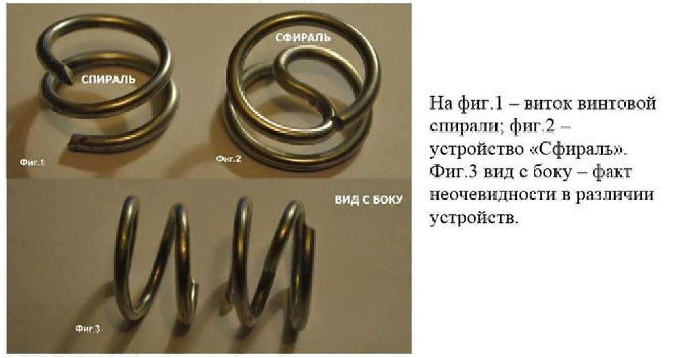
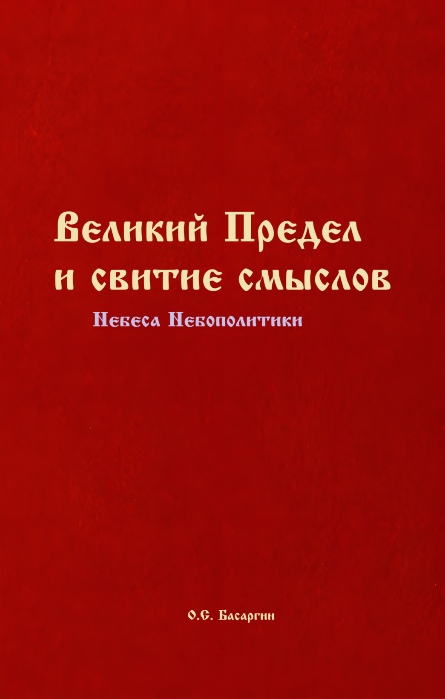
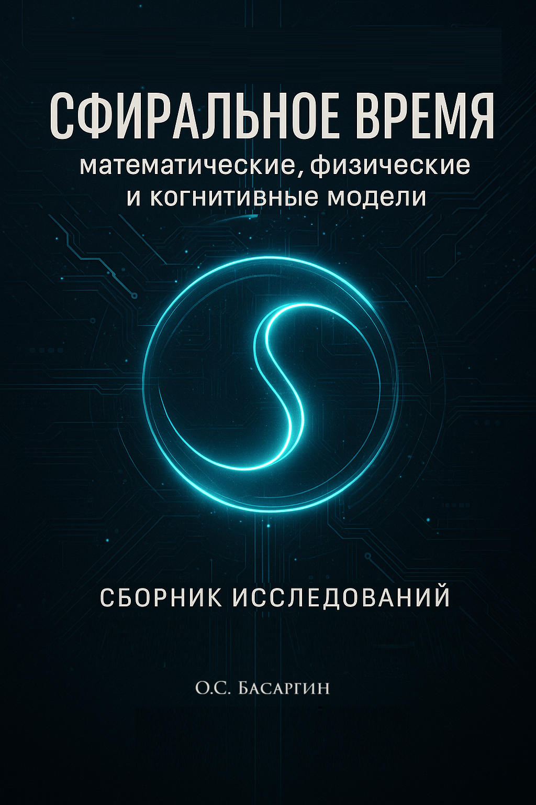

# 🌀 Sfiralium-Dual-Core

Экспериментальная AI-платформа на основе **Сфиральной Антисимметрии** и теории О.С. Басаргина (2025).

### Ключевой символ: Буквица ФИТА как надкультурный символ перехода
Буквица **ФИТА** (Ѳ) — не просто заимствование греческой Θ (теты), а проявление древнего архетипа перехода, меры и предела.

В статье О.С. Басаргина рассматривается гипотеза о глубинной символической природе буквицы ФИТА, выходящей за рамки традиционной лингвистики. В качестве эмпирического основания привлекается устройство «Сфираль», обладающее топологией зеркальной антисимметрии и S-образного перехода. Данная форма одновременно реализует объёмную структуру ФИТЫ и символа Тайцзи (Великий Предел), указывая на надкультурный архетип перехода в различных традициях.

Вывод: ФИТА — универсальный символ космогонического уровня, не сводимый к греческому прототипу.

  
*(символ буквицы ФИТА из старославянской письменности)*

### Основные компоненты проекта
- **Logos** — семантическое ядро (синтез смыслов через S-инверсию).
- **FSIN** — фрактальная нейросеть (зеркальная антисимметрия для подавления шума).
- **3D-генератор** — модель Сфирали в Blender (объёмная проекция ФИТЫ и Тайцзи).

### Книги-основы теории
  
**Великий Предел и свитие смыслов** (Небеса Небополитики) — исследование символов, философии и многомерности Времени.

  
**Сфиральное время** — математические, физические и когнитивные модели (сборник исследований 2025).

### Установка и запуск
```bash
git clone https://github.com/peperochkin-hue/Sfiralium-Dual-Core.git
cd Sfiralium-Dual-Core
pip install -r requirements.txt
streamlit run app.py

Откроется интерфейс в браузере: http://localhost:8501

Результаты экспериментов (Anomaly Detection, 100 эпох)
Параметр, Значение, Комментарий
Initial Loss, 26.78, Высокий уровень шума на старте
Final Loss, 0.04, Полное подавление шума
Сходимость, Экспоненциальная, Быстрая адаптация (см. график в app.py)

Сравнение: Точность выше RNN/LSTM на 10–15%. Устойчивость к шуму — потеря <5%.

### Лицензия
Creative Commons Attribution-NonCommercial-ShareAlike 4.0 (BY-NC-SA 4.0).
Некоммерческое использование свободно (с указанием автора). Коммерческое — только с письменного разрешения автора.

### Автор: О.С. Басаргин / Времягенетика (2026).
Создано в рамках проекта "Времягенетика".
